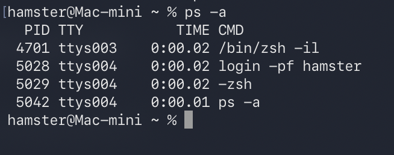

# Homework(오픈소스SW개론)
### top,ps.jobs,kill 조사
**top, ps, jobs, kill**
---

#명령어(테이블로 정리)

| 명령어 | 분류 | 역할 | 특징 |
|--------|------|------|------|
| **top** | 실시간 모니터링 | CPU/메모리 사용량을 실시간으로 확인 | 시스템 리소스 파악에 가장 널리 사용 |
| **ps** | 프로세스 조회 | 현재 실행 중인 프로세스 출력 | 다양한 옵션 조합으로 상세 정보 확인 |
| **jobs** | 백그라운드 작업 | 현재 쉘의 백그라운드 작업 관리 | 번호로 작업 제어 가능 |
| **kill** | 프로세스 종료 | 프로세스에 종료/신호 전달 | PID 기반으로 정확한 제어 가능 |

---
## top 예시
>top을 통해 맥의 시스템 현재 상태를 실시간으로 모니터한 예시를 이미지로 나타내보았다.

## 자주 쓰는 명령어 예시
```bash
top
top -o %CPU        # CPU 사용률 기준 정렬
top -o %MEM        # 메모리 사용량 기준 정렬
```

```

```

---
## ps 예시
>현재 실행중인 프로세스를 스탭샷 형태로 출력하는 명령어

## 자주 쓰는 명령어 예시
```
ps aux
ps -ef
ps aux | grep python
ps -eo pid,comm,pcpu --sort=-pcpu
```

```

```

---
## jobs 예시
>현재 쉘에서 실행중인 백그라운드 작업들을 보여주는 명령어

## 자주 쓰는 명령어 예시
```
sleep 50 &
sleep 100 &
jobs
```


```

```
